# COMP2150  - Level Design Document
### Name: Aaron Wilson
### Student number: 47539615

This document discusses and reflects on the design of your platformer level for the Level Design assessment. It should be 1500 words. Make sure you delete this and all other instructional text throughout the document before checking your word count prior to submission. Hint: You can check word count by copying this text into a Word or Google doc.

Your document must include images. To insert an image into your documentation, place it in the "DocImages" folder in this repo, then place the below text where you want the image to appear:

```

```

Example:


## 1. Player Experience (~700 words)
Outline and justify how your level design facilitates the core player experience goals outlined in the assignment spec. Each section should be supported by specific examples and screenshots of your game encounters that highlight design choices made to facilitate that particular experience.

### 1.1. Discovery
What does the player learn? How does your encounter and broader level design facilitate learning in a way that follows good design practice?

### 1.2. Drama
What is the intensity curve? How does your design facilitate increasing yet modulating intensity, with moments of tension and relief? 

### 1.3. Challenge
What are the main challenges? How have you designed and balanced these challenges to control the difficulty curve and keep the player in the flow channel?

### 1.4. Exploration
How does your level design facilitate autonomy and invite the player to explore? How do your aesthetic and layout choices create distinct and memorable spaces and/or places?

## 2. Core Gameplay (~400 words)
A section on Core Gameplay, where storyboards are used to outline how you introduce the player to each of the required gameplay elements in the first section of the game. Storyboards should follow the format provided in lectures.

Storyboards can be combined when multiple mechanics are introduced within a single encounter. Each section should include a sentence or two to briefly justify why you chose to introduce the mechanic/s to the player in that sequence.

You should restructure the headings below to match the order they appear in your level.

### 2.1. Acid and Checkpoints
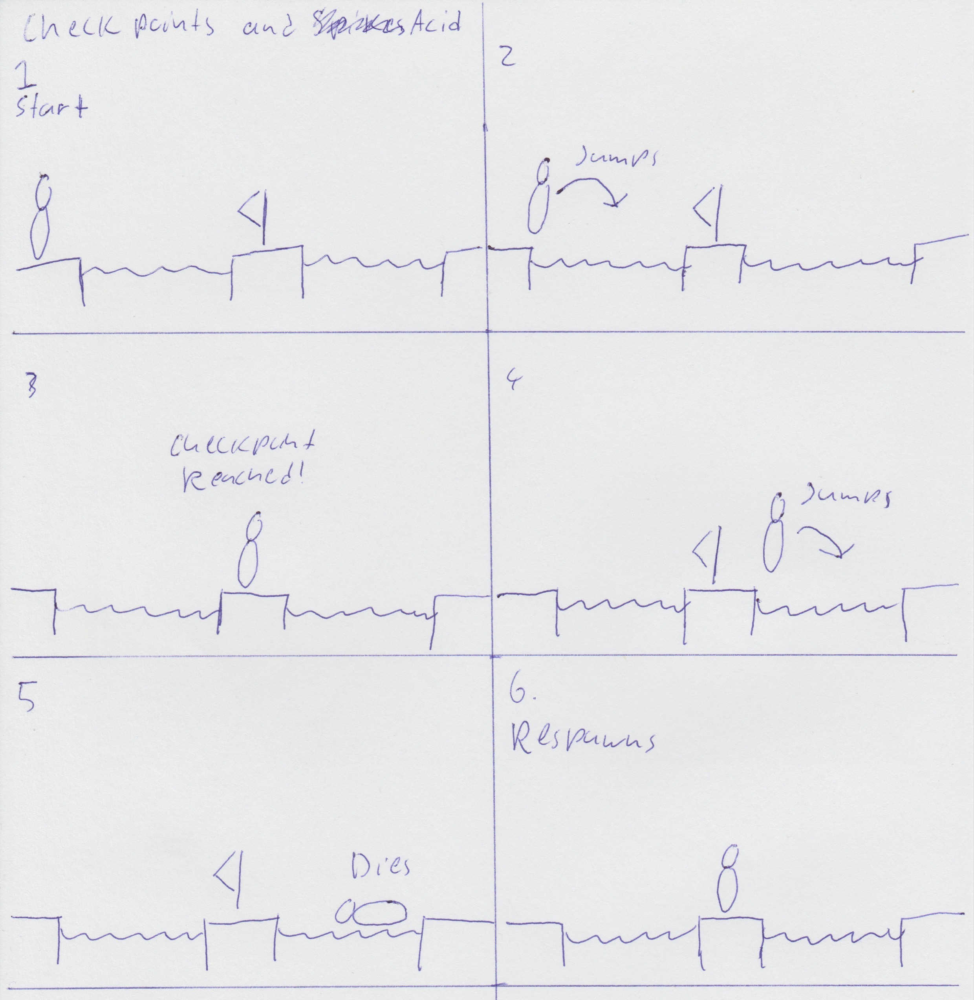

Understanding how checkpoints work is crucial for players as it plays into the intensity curve and provides peroids of relief. For this reason, it was important that checkpoints were introduced with a hazardous mechanic. 

Acid was chosen for this as it essentially acts as a hard reset for players in the game, either reseting their progress or reverting them to a previous checkpoint. By having Acid and Checkpoints introduced in a single encounter, it allows players to safely investigate the properties of Acid while being given a saftey net.

### 2.2. Chompers and Weapon Pickup (Staff)
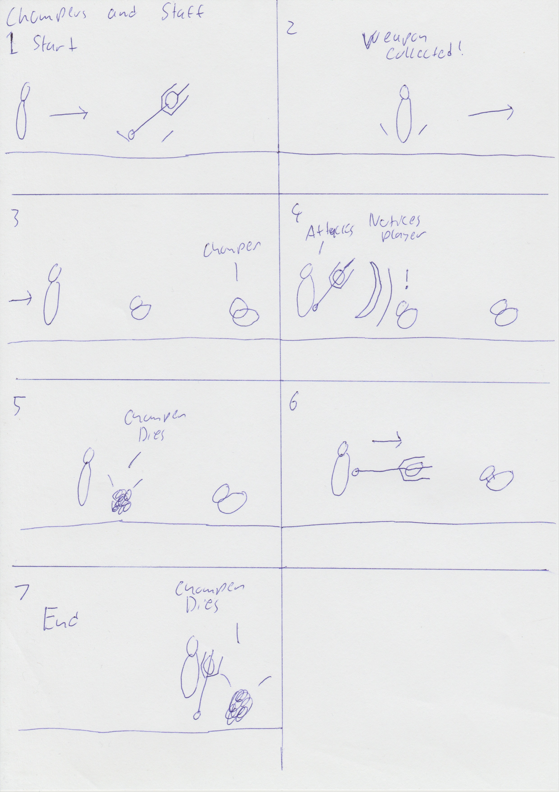

In some parts of the game players will encounter Chompers, a melee based enemy that may serve as a road block to players and provide them with a challenge. For this reason Chompers are introduced in a single pair so that players may safely understand their capabilities.

In this case, the player is introduced to the staff melee weapon pickup followed immediately by a pair of chompers. By being introduced in this order, players will draw connections between the Chompers and the Staff and be given an opportunity to discover the dynamics between these two mechanics.

### 2.3. Health Pickups and Passthrough Platforms
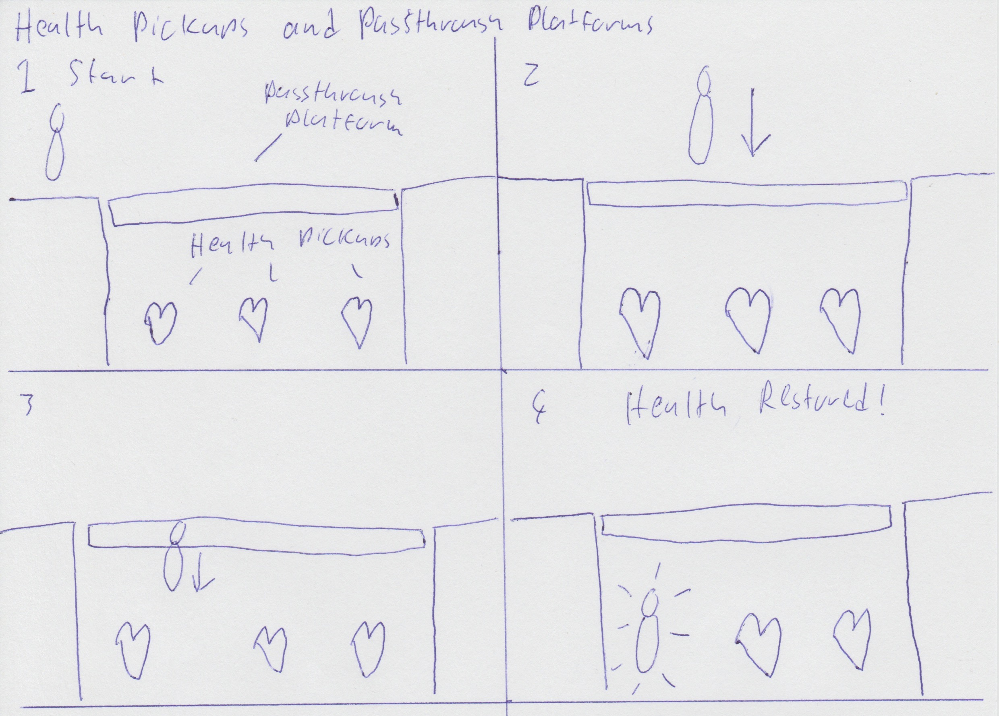

Health Pickups are arguably the most critical mechanic of the game, as it provides players with a point of relief and hope. As players will always be inclinded to collect health pickups, they can be introduced with another mechanic within the same encounter to help players learn.

For this purpose, passthrough platforms were chosen as the second mechanic. Players will notice the health pickups underneath the platform and attempt to experiment in order to reach them, eventually passing through into what would seem like an impossible to reach area. This combination of mechanics allows the player to learn through play.

### 2.4. Keys
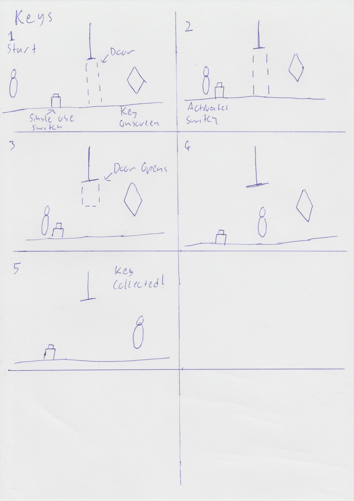

Keys are required to open the final door to proceed to the next level, for this reason I chose to place a key behind a door with a switch to open it. I chose to introduce keys this way so that players draw a connection between keys and doors, as collecting three keys is required to progress to the next level.

### 2.5. Moving Platforms and Spikes
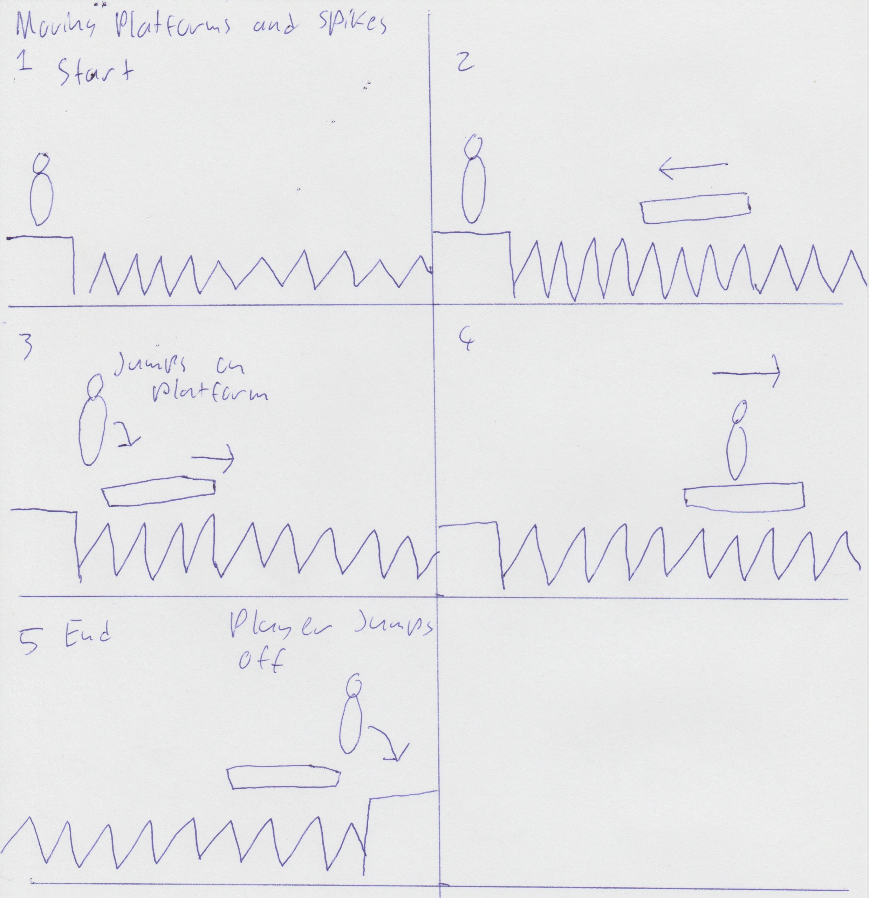

Moving platforms are a method of transportation for the player to be carried from one point in the game world to another. As such, it is important that they are introduced with another mechanic that encourages players to use them.

For this reason, spikes are introduced to the player with moving platforms. It provides the player with a hazardous encounter, and provides them with a solution to overcome the encounter. Players will recognise moving platorms as a means of transportation through areas a player otherwise may not be able to progress through.

### 2.6. Spitters and Weapon Pickup (Gun)
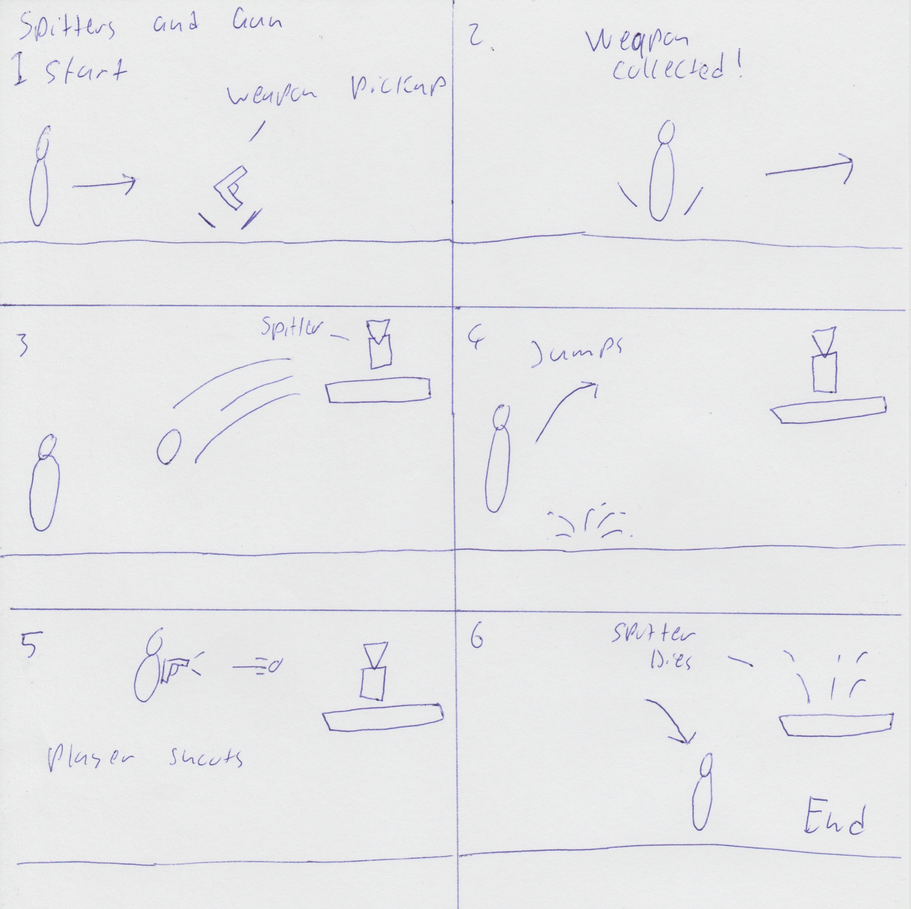

Throughout the game, players will encounter enemies that provide moments of tension for the player. As such, it is important to introduce enemies to the player in a safe manner while also giving players the opportunity to familiarise themselves with the tools at their disposal.

In this instance, the player is introduced to the gun weapon pickup and then encounters a single spitter. After picking up the gun and encountering the spitter, players will understand the guns ideal purpose in the core gameplay loop and it's dynamic when used against spitters.

## 3. Spatiotemporal Design
A section on Spatiotemporal Design, which includes your molecule diagram and annotated level maps (one for each main section of your level). These diagrams may be made digitally or by hand, but must not be created from screenshots of your game. The annotated level maps should show the structure you intend to build, included game elements, and the path the player is expected to take through the level. Examples of these diagrams are included in the level design lectures.

No additional words are necessary for this section (any words should only be within your images/diagrams).
 
### 3.1. Molecule Diagram
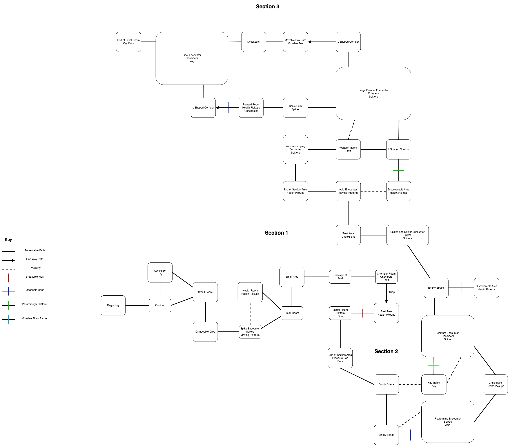

### 3.2. Level Map – Section 1


### 3.3.	Level Map – Section 2


### 3.4.	Level Map – Section 3


## 4. Iterative Design (~400 words)
Reflect on how iterative design helped to improve your level. Additional prototypes and design artefacts should be included to demonstrate that you followed an iterative design process (e.g. pictures of paper prototypes, early grey-boxed maps, additional storyboards of later gameplay sequences, etc.). You can also use this section to justify design changes made in Unity after you drew your level design maps shown in section 3. 

You should conclude by highlighting a specific example of an encounter, or another aspect of your level design, that could be improved through further iterative design.

The iterative design process allowed me to test out the concepts from the level maps, and adapt them to better suit the gameplay loop in engine. The first encounter with acid seemed a little too difficult for an introduction to checkpoints, so the first acid pit was removed as seen in the image below.

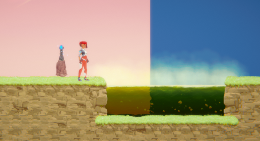

The chomper encounter storyboard for the first section did not account for the chompers ability to move up until they encounter a ledge or a wall. This meant that the chompers could move ontop of the staff weapon pickup. This was adjusted with a small bump being added after the staff pickup so the chompers remain in a controlled area.

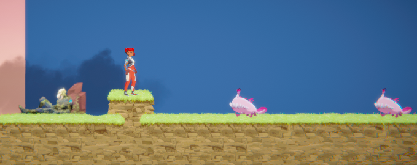

The vertical jumping segment around the checkpoint in section two was not only very difficult, but also impossible as the player could not reach the second platform. A storyboard was used to conceptualise a potential change to be tested, which was then implemented into the game in Unity with a greybox design. As highlighted in the two images below.

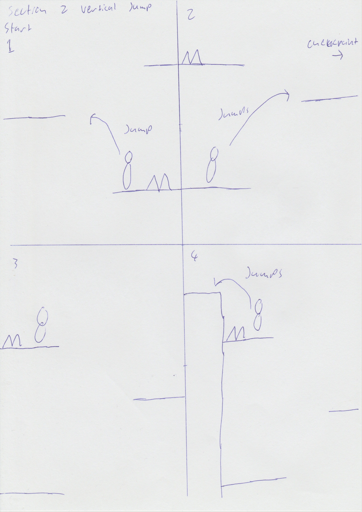

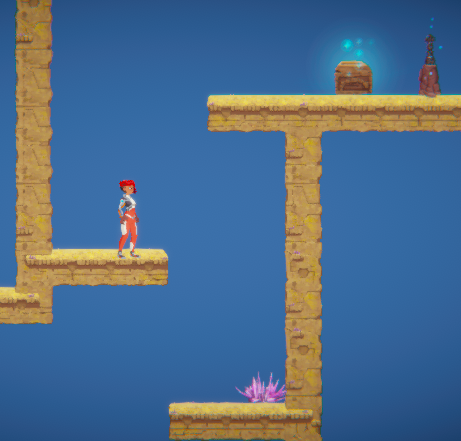

The positioning of the key room in section two did not translate well from concept to in engine, the keyroom was not visible from the start of the platforming encounter. This was changed in engine to have the keyroom take up slightly more space to make the key visible to players. This is reflected in the screenshot below.

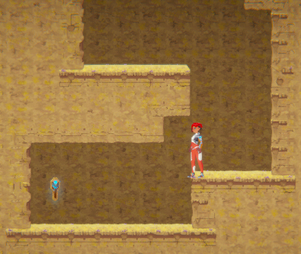

The first pushable box in the pushable box puzzle in section 3 was not positioned correctly, making it impossible to push to the tall wall. This change is reflected in this image.

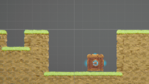

An encounter I would like to focus on is the final encounter in section 3, which is shown on the section 3 level map. This encounter is meant to serve as the climax of the level, however when brought over to Unity, this encounter felt very underwhelming. So I decided to conceptualise an entirely new layout from this encounter, in a similar way to how the level maps were done. I wanted the encounter to be larger, and more difficult, but most importantly a memorable encounter that the player can look back on. For this, I decided to include new prefabs, as indicated in the design image below.


This encounter design is much more sophisticaed, and offers two routes for the player towards the end. The starting points are the same as the original counter design, but begin as seperate paths that merge into one. The player is then taken on three moving platform sequences, with a brief moment of relief in betwee the second and first sequence. While this design is a improvement from the original design, the final encounter of section is still an area of the level that I feel could see greater improvements through further iterative design.

## Generative AI Use Acknowledgement

Use the below table to indicate any Generative AI or writing assistance tools used in creating your document. Please be honest and thorough in your reporting, as this will allow us to give you the marks you have earnt. Place any drafts or other evidence inside this repository. This form and related evidence do not count to your word count.
An example has been included. Please replace this with any actual tools, and add more as necessary.


### Tool Used: ChatGPT
**Nature of Use** Finding relevant design theory.

**Evidence Attached?** Screenshot of ChatGPT conversation included in the folder "GenAI" in this repo.

**Additional Notes:** I used ChatGPT to try and find some more relevant design theory that I could apply to my game. After googling them, however, I found most of them were inaccurate, and some didn't exist. One theory mentioned, however, was useful, and I've incorporated it into my work.

### Tool Used: Example
**Nature of Use** Example Text

**Evidence Attached?** Example Text

**Additional Notes:** Example Text


