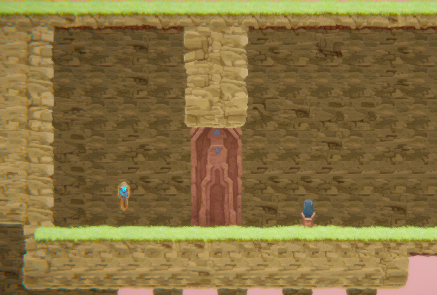
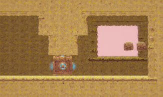
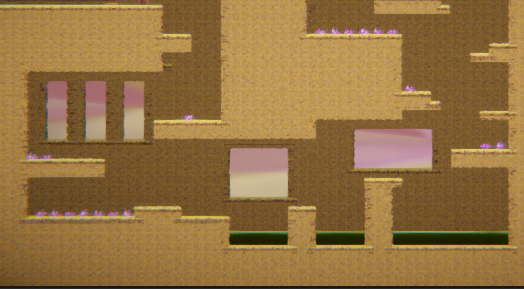
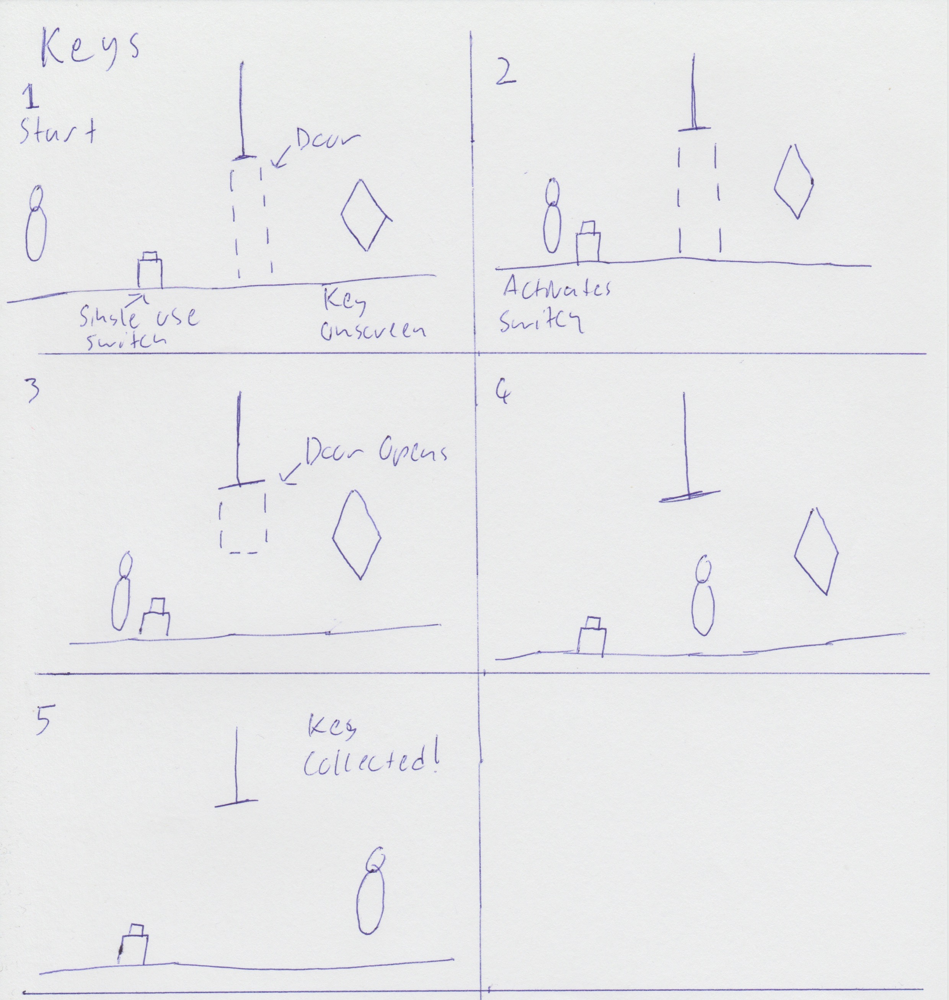

# COMP2150  - Level Design Document
### Name: Aaron Wilson
### Student number: 47539615

## 1. Player Experience (~700 words)
Outline and justify how your level design facilitates the core player experience goals outlined in the assignment spec. Each section should be supported by specific examples and screenshots of your game encounters that highlight design choices made to facilitate that particular experience.

### 1.1. Discovery

The player learns the mechanics of the game through play. At the start of section one, the player is greeted with the first key in their field of fov. Upon navigating to the key, the player will notice it is obstructed by a door that is opened by a switch. This introduction to keys allows the players to learn how to open the final door.

When the player is introduced to their first weapon, the staff, they encounter two chompers which allows them to understand how the staff works. They are greeted by a destructable wall shortly after. As it can't be pushed, the player may try to break it. This facilitates discovery through learning from play.

Finally, in section two the player will encounter a small hallway leading to a room with health pickups obstructed by a box. This box has a different appearance to the first, leading the player to experiment with ways to get past the box. This facilitates learning by allowing players to experiment with their surroundings, and learn from previous experiences.

### 1.2. Drama

Throughout the level, there are various points of tension and relief. Between most encounters, there are peroids of relief in the form of short platforming segments, or small rest rooms which give the player an opportunity to breath. The intensity curve starts off with the first segment guiding the player through the games mechanics. Then the player passes intom section two, and is introduced to their first platforming encounter. Combining both spikes and acid which leads to the player feeling more anxious about their next moves.

Afterwards, the player passes through a checkpoint, granting them a moment of relief. They then pass through a simple combat encounter, and a series of jumps up a vertical chamber. This keeps the players going with the flow of the level while decreasing the anxiety they may have felt from the previous section.

Finally, after passing through the rest of section two, the player moves into section three. This section contains a series of difficult encounters to keep the player on edge, while providing brief moments of relief in between. Section three ends with a climactic final encounter that tests the players skills built up from the previous encounters.

### 1.3. Challenge

The main challenges in the level involve platforming and combat. Section three includes two challenges that are designed to keep the player on their feet. The first challenge in section three is a combat and platforming encounter that branches off into a difficult platforming challenge. This challenge is balanced to give players platforms to engage in combat with enemies in.

The second challenge of the levels main challenges is the final encounter of section three, which sees the difficulty rise as the player works with the dynamics learnt from previous encounters. The moving platforms move at a constant pace, however they are balanced in a way that they do not move too fast as to not make the player feel rushed. These encounters keep the player in the flow channel by having a steady raise in difficulty and while requiring skill as players work with dynamics from previous segments of the level.

### 1.4. Exploration

Throughout the level, the player is given various opportunities to explore in their own ways. There are many rooms in the level that the player will see in their field of view, but won't see an entrance to until later on, or will be obstructed by an obstacle of some kind. One of these rooms is a small room containing health pickups that the player will notice at the start of section three. When entering section three, the player is eventually greeted with a passthrough platform on the ground. Passing through this platform leads the player to the room they saw moments before. Encounters such as these invite the player to explore spaces in the level that intrigue them.

At one point in section three, the player is given two paths for progressing through the level. One path leads to a difficult spike encounter, while the other leads to a box puzzle area. If the player chooses to go through the difficult spike encounter, they will be rewarded with two additional health pickups. This layout choice creates a memorable space as the players are rewarded for their exploration.

## 2. Core Gameplay (~400 words)

### 2.1. Acid and Checkpoints

Understanding how checkpoints work is crucial for players as it plays into the intensity curve and provides peroids of relief. For this reason, it was important that checkpoints were introduced with a hazardous mechanic. 

By having Acid and Checkpoints introduced in a single encounter, it allows players to safely investigate the properties of Acid while being given a saftey net.

### 2.2. Chompers and Weapon Pickup (Staff)

In some parts of the game players will encounter Chompers, an enemy that may serve as a road block to players and provide them with a challenge. For this reason Chompers are introduced in a single pair so that players may safely understand their capabilities.

In this case, the player is introduced to the staff melee weapon pickup followed immediately by a pair of chompers. By being introduced in this order, players will draw connections between the Chompers and the Staff and be given an opportunity to discover the dynamics between these two mechanics.

### 2.3. Health Pickups and Passthrough Platforms

Health Pickups are arguably the most critical mechanic of the game, as it provides players with a point of relief and hope. As players will always be inclinded to collect health pickups, they can be introduced with another mechanic within the same encounter to help players learn.

For this purpose, passthrough platforms were chosen as the second mechanic. Players will notice the health pickups underneath the platform and attempt to experiment in order to reach them, eventually passing through into what would seem like an impossible to reach area. This combination of mechanics allows the player to learn through play.

### 2.4. Keys

Keys are required to open the final door to proceed to the next level, for this reason I chose to place a key behind a door with a switch to open it. I chose to introduce keys this way so that players draw a connection between keys and doors, as collecting three keys is required to progress to the next level.

### 2.5. Moving Platforms and Spikes

Moving platforms are a method of transportation for the player to be carried from one point in the game world to another. As such, it is important that they are introduced with another mechanic that encourages players to use them.

For this reason, spikes are introduced to the player with moving platforms. It provides the player with a hazardous encounter, and provides them with a solution to overcome the encounter. Players will recognise moving platorms as a means of transportation through areas a player otherwise may not be able to progress through.

### 2.6. Spitters and Weapon Pickup (Gun)

Throughout the game, players will encounter enemies that provide moments of tension for the player. It is important to introduce enemies while giving players the opportunity to familiarise themselves with the tools at their disposal.

In this instance, the player is introduced to the gun weapon pickup and then encounters a single spitter. After picking up the gun and encountering the spitter, players will understand the guns ideal purpose in the core gameplay loop and it's dynamic when used against spitters.

## 3. Spatiotemporal Design

### 3.1. Molecule Diagram

### 3.2. Level Map – Section 1

### 3.3.	Level Map – Section 2

### 3.4.	Level Map – Section 3

## 4. Iterative Design (~400 words)

The iterative design process allowed me to test out the concepts from the level maps, and adapt them to better suit the gameplay loop in engine. The first encounter with acid seemed a little too difficult for an introduction to checkpoints, so the first acid pit was removed as seen in the image below.

The chomper encounter storyboard for the first section did not account for the chompers ability to move up until they encounter a ledge or a wall. This was adjusted with a small bump being added after the staff pickup so the chompers remain in a controlled area.

The vertical jumping segment around the checkpoint in section two was not only very difficult, but also impossible as the player could not reach the second platform. A storyboard was used to conceptualise a potential change to be tested, which was then implemented into the game in Unity with a greybox design. As highlighted in the two images below.

The positioning of the key room in section two did not translate well from concept to in engine, the keyroom was not visible from the start of the platforming encounter. This was changed in engine to have the keyroom take up slightly more space to make the key visible to players. This is reflected in the screenshot below.

The first pushable box in the pushable box puzzle in section 3 was not positioned correctly, making it impossible to push to the tall wall. This change is reflected in this image.

An encounter I would like to focus on is the final encounter in section 3, which is shown on the section 3 level map. This encounter is meant to serve as the climax of the level, however when brought over to Unity, this encounter felt very underwhelming. So I decided to conceptualise an entirely new layout from this encounter, in a similar way to how the level maps were done. I wanted the encounter to be larger, and more difficult, but most importantly a memorable encounter that the player can look back on.

This encounter design is much more sophisticated, and offers two routes for the player towards the end. The player is then taken on three moving platform sequences, with a brief moment of relief in betwee the second and first sequence. While this design is a improvement from the original design, the final encounter of section is still an area of the level that I feel could see greater improvements through further iterative design.
